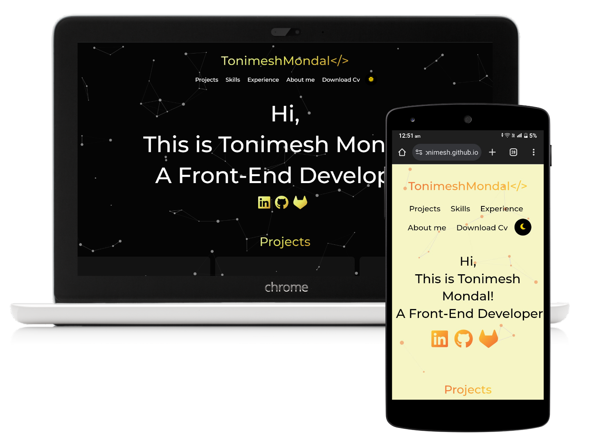
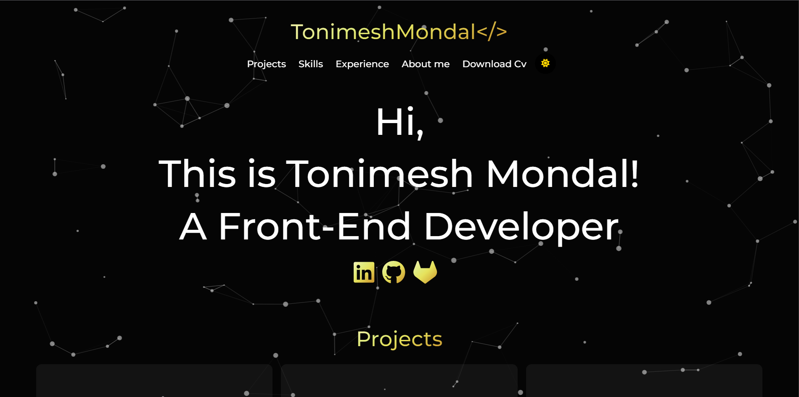
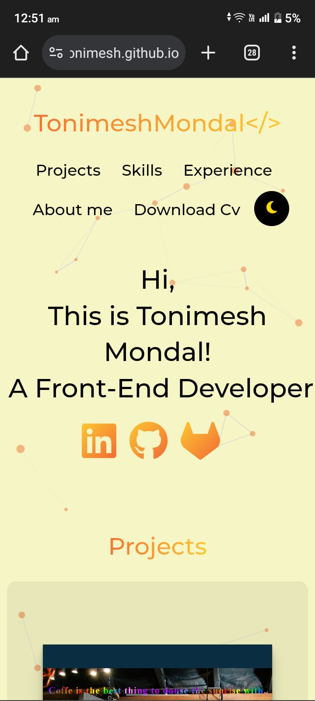

# My Portfolio
   

Hi Everyone! 🙋‍♂️ 
I have been learning React JS ⚛ and I just updated my portfolio with it. I would love your feedback! ✍ 
You may contact me on my [LinkedIn](https://www.linkedin.com/in/tonimesh-mondal)

## Screenshots:
### Desktop View

### Mobile View

